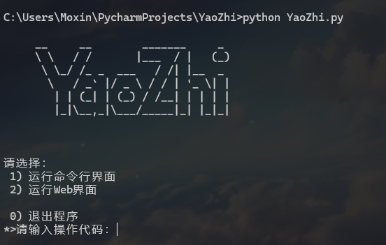
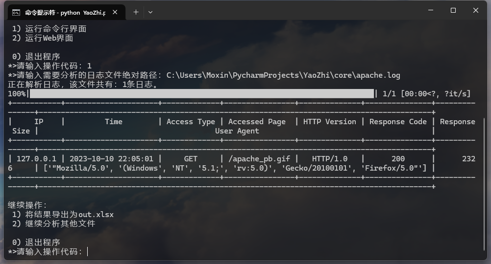
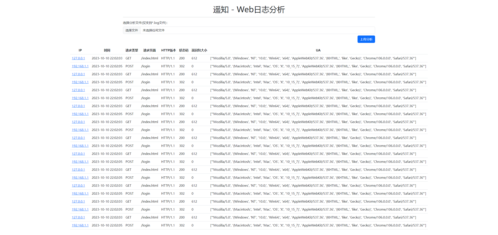

# 遥知 - 日志分析工具
该项目适用于分析Nginx和Apache的网站访问日志。

# 使用帮助
1. Clone本项目
2. 安装requirements.txt中的依赖
3. 运行YaoZhi.py
4. 根据提示选择操作接口
5. 选择文件进行分析
# 代码帮助
```shell
git clone https://github.com/Moxin1044/YaoZhi
cd YaoZhi
python3 -m pip install -r requirements.txt
python3 Yaozhi.py
```
# 截图





