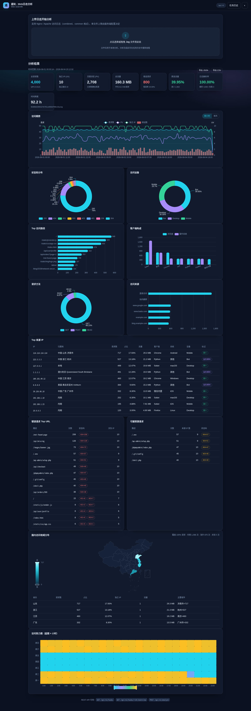

# 遥知 · Web 日志分析

一款面向 Web 访问日志的分析工具：上传 Nginx / Apache 访问日志，**实时**得到多维度的流量画像——总览指标、时间趋势、状态码分布、Top 路径与来源 IP（含归属地）、客户端构成、爬虫识别、错误分析与可疑探测识别。

同时提供完整的 **REST API**，方便接入自动化流程或二次开发。



> 深色主题为默认；点击右上角 ◐ 可切换浅色主题，面板已适配移动端。

## 特性

- **多维度分析**：11 个分析维度，覆盖流量、来源、客户端、错误与安全视角
- **健壮的日志解析**：正则整行匹配（而非按空格切分），能正确处理 User-Agent 含空格、Referer 缺失、请求行为 `-`、带 vhost 前缀等真实情况；支持 nginx combined / common 与 apache combined
- **正确的时区处理**：解析日志中的时区偏移并按目标时区归一（不再写死 +8）
- **客户端与爬虫识别**：内置规则解析浏览器、操作系统、设备类型，并识别 Googlebot / Baiduspider / 各类采集与监控脚本
- **IP 归属地**：内网 / 回环 / 保留地址本地判定，公网地址远程批量查询并落盘缓存（离线环境自动降级，不阻塞分析）
- **安全视角**：识别 `.env`、`.git`、`wp-admin`、`phpmyadmin` 等常见探测路径，并统计错误请求 Top URL
- **现代化面板**：深色 / 浅色双主题、ECharts 图表、移动端自适应
- **REST API**：任务与维度化接口，统一响应结构，支持同步分析接口
- **容器化部署**：Docker Compose 一键起，gunicorn 多进程 + 健康检查

## 快速开始

### Docker Compose（推荐）

```bash
git clone https://github.com/Moxin1044/YaoZhi.git
cd YaoZhi
docker compose up -d --build
```

浏览器打开 **http://localhost:7100** ，拖入 `.log` 文件即可。

生产部署建议设置密钥与归属地开关：

```bash
cat > .env <<'EOF'
YAOZHI_SECRET_KEY=换成你的随机字符串
YAOZHI_GEO_REMOTE=1
EOF
docker compose up -d
```

### 本地运行

```bash
python3 -m venv .venv && source .venv/bin/activate
pip install -r requirements.txt

# Web 界面（默认 7100 端口）
python YaoZhi.py          # 交互式选择
python YaoZhi_Server.py   # 直接启动 Web

# 命令行分析
python -c "import core; print(core.analyze_file('/path/to/access.log')['overview'])"
```

## 分析维度

| 维度 | 说明 |
| --- | --- |
| **总览** | 总请求、独立 IP(UV)、页面浏览(PV，可排除静态资源)、总流量、平均响应大小、错误数/错误率、爬虫占比、独立路径数、QPS、时间跨度 |
| **时间趋势** | 按分钟/小时/天/月聚合，含请求数、PV、UV、流量、错误数（自动补齐缺失时间点） |
| **状态码** | 全量状态码分布 + 2xx/3xx/4xx/5xx 分组占比 |
| **Top URL** | 请求数、占比、流量、平均大小、错误数、状态码构成、涉及 IP 数 |
| **Top IP** | 请求数、占比、流量、归属地、浏览器/系统/设备、爬虫标记、最后访问时间 |
| **客户端** | 浏览器、操作系统、设备类型分布，Top User-Agent，识别到的爬虫清单 |
| **来源** | 直接访问 / 站内跳转 / 外部来源域名 Top 榜 |
| **请求方法** | GET/POST/HEAD 等方法分布与流量 |
| **错误分析** | 错误状态码分布、错误 URL Top 榜（含状态码构成）、错误来源 IP（含归属地）、最近错误明细 |
| **可疑请求** | 命中常见攻击/探测特征的路径统计 |
| **访问热力图** | 星期 × 小时 的访问量矩阵 |

## REST API

基础路径 `/api/v1`，统一响应结构：

```json
{ "code": 0, "message": "ok", "data": { } }
```

### 基础

| 方法 | 路径 | 说明 |
| --- | --- | --- |
| GET | `/api/v1/health` | 健康检查 |
| GET | `/api/v1/info` | 平台信息与支持的维度清单 |

### 任务

| 方法 | 路径 | 说明 |
| --- | --- | --- |
| GET | `/api/v1/tasks?page=1&limit=20` | 任务列表（含关键指标摘要） |
| GET | `/api/v1/tasks/{id}` | 任务详情（元信息、解析统计、摘要） |

### 维度化查询

| 方法 | 路径 | 说明 |
| --- | --- | --- |
| GET | `/api/v1/tasks/{id}/overview` | 总览指标 |
| GET | `/api/v1/tasks/{id}/timeseries?interval=hour` | 时间序列（minute/hour/day/month） |
| GET | `/api/v1/tasks/{id}/status-codes` | 状态码分布与分组 |
| GET | `/api/v1/tasks/{id}/top-urls?limit=20` | Top 访问路径 |
| GET | `/api/v1/tasks/{id}/top-ips?limit=20` | Top 来源 IP（含归属地） |
| GET | `/api/v1/tasks/{id}/clients` | 客户端构成（浏览器/系统/设备/爬虫） |
| GET | `/api/v1/tasks/{id}/referers?limit=20` | 来源分布 |
| GET | `/api/v1/tasks/{id}/methods` | 请求方法分布 |
| GET | `/api/v1/tasks/{id}/errors?limit=50` | 错误分析 |
| GET | `/api/v1/tasks/{id}/suspicious?limit=50` | 可疑探测请求 |
| GET | `/api/v1/tasks/{id}/heatmap` | 访问热力图 |
| GET | `/api/v1/tasks/{id}/export?format=json\|csv` | 结果导出 |

### 同步分析（无需建任务）

```bash
# 直接投递日志文本，立即返回完整分析结果
curl -X POST http://localhost:7100/api/v1/analyze \
  -H 'Content-Type: application/json' \
  -d '{"text": "127.0.0.1 - - [01/Aug/2026:12:00:00 +0800] \"GET / HTTP/1.1\" 200 123 \"-\" \"curl/8.5.0\"", "timezone": "Asia/Shanghai"}'

# 或直接 POST 原始文本
curl -X POST http://localhost:7100/api/v1/analyze \
  -H 'Content-Type: text/plain' --data-binary @access.log
```

## 配置项

| 环境变量 | 默认值 | 说明 |
| --- | --- | --- |
| `YAOZHI_DB` | `tasks.db` | SQLite 数据库路径 |
| `YAOZHI_UPLOAD_DIR` | `./uploads/logs/` | 上传日志存放目录 |
| `YAOZHI_SECRET_KEY` | 内置默认值 | Flask 会话密钥（生产务必修改） |
| `YAOZHI_TZ` | `Asia/Shanghai` | 日志时间归一化的目标时区 |
| `YAOZHI_GEO_REMOTE` | `1` | 是否启用 IP 归属地远程查询（离线环境设 `0`） |
| `YAOZHI_TOP_LIMIT` | `20` | Top 榜单默认条数 |

## 目录结构

```
YaoZhi/
├── core/                  # 分析核心
│   ├── parser.py          #   日志解析（正则/多格式/时区）
│   ├── useragent.py       #   UA 解析（浏览器/系统/设备/爬虫）
│   ├── ipgeo.py           #   IP 归属地（本地判定 + 远程批量 + 缓存）
│   ├── analyzer.py        #   多维度统计分析
│   └── service.py         #   服务层（读文件 → 解析 → 分析）
├── cli/main.py            # 命令行界面
├── web/
│   ├── server.py          # Flask 应用（页面 + 任务）
│   ├── api.py             # REST API（/api/v1）
│   ├── templates/         # 页面模板
│   └── static/            # 样式 / 脚本 / ECharts（本地化）
├── tests/                 # 单元测试与样例数据生成
├── scripts/               # 前端验收脚本（CDP）
├── Dockerfile
└── docker-compose.yml
```

## 开发与测试

```bash
# 单元测试（解析 / UA / 归属地 / 11 个分析维度）
pytest tests/ -v

# 前端验收（需要先启动服务，Node 18+）
node scripts/verify_frontend.mjs <task_id> http://127.0.0.1:7100
```

## 日志格式要求

默认按 **combined** 格式解析，字段顺序：

```
$remote_addr - $remote_user [$time_local] "$request" $status $body_bytes_sent "$http_referer" "$http_user_agent"
```

Nginx 配置参考：

```nginx
log_format main '$remote_addr - $remote_user [$time_local] "$request" '
                '$status $body_bytes_sent "$http_referer" "$http_user_agent"';
access_log /var/log/nginx/access.log main;
```

## 许可证

本项目采用 MIT 许可证。
